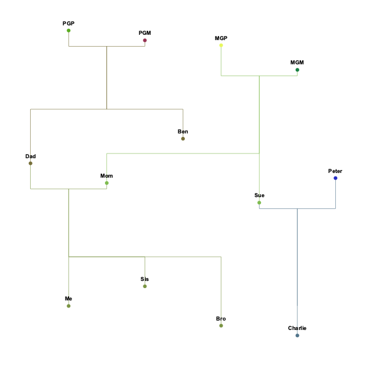

# FamTree
A Python program to load and display a family-tree from a CSV-file.

Written for a personal project by [Bryan Luu](https://github.com/bryanluu).

## Contents
- Setup
- CSV Format
- Usage
- Example

## Setup
### Python
This program uses Python 3.8. It _should_ be compatible with other Python 3 versions but no guarantees can be made (sorry!).

To install Python 3.8, you can get it from the [official website](https://www.python.org/downloads/).
### Libraries
The following Python libraries were used:
- `numpy` to process numerical data
- `pandas` to read in the CSV file
- `cairo` to draw the family tree in SVG format
- `io` for display in Jupyter
- `IPython` for display in Jupyter

Install `numpy`:
Run `pip3 install numpy` in the command line.

Install `pandas`:
Run `pip3 install pandas` in the command line.

Install `cairo`:
follow instructions to [install Cairo](https://www.cairographics.org/download/) first, then run `pip3 install pycairo`.

Install `io`: no installation needed.

Install `IPython`:
Run `pip3 install ipython` in the command line.

## CSV Format
To load up your family tree, it is important that you follow the desired CSV format. An example CSV table is below:
| Full Name            | Nickname | Year Born | Father               | Mother               | Spouse                | Children                |
| -------------------- | ---------| --------- | -------------------- | -------------------- | --------------------- | ----------------------- |
| Father               | Dad      | 1965      | Paternal Grandfather | Paternal Grandmother | Mother                | Me, Brother, Sister     |
| Mother               | Mom      | 1969      | Maternal Grandfather | Maternal Grandmother | Father                | Me, Brother, Sister     |
| Me                   |          | 1994      | Father               | Mother 		          |                       |                         |
| Sister               | Sis      | 1990 	    | Father 	             | Mother 		          |                       |                         |
| Brother 	           | Bro      | 1998 	    | Father 	             | Mother 		          |                       |                         |
| Paternal Grandfather | PGP      | 1938      |	                     |                      | Paternal Grandmother  | Father, Ben             |
| Paternal Grandmother | PGM      | 1940      |	                     |                      | Paternal Grandfather  | Father, Ben             |
| Maternal Grandfather | MGP      | 1941      |	                     |                      | Maternal Grandmother  | Mother, Sue             |
| Maternal Grandmother | MGM      | 1946      |	                     |                      | Maternal Grandfather  | Mother, Sue             |
| Ben 	               |          | 1960      | Paternal Grandfather | Paternal Grandmother |                       |                         |
| Sue 	               |          | 1973      | Maternal Grandfather | Maternal Grandmother | Peter                 |	Cousin                  |
| Peter                |          | 1968 		  |                      |                      | Sue                   | Cousin                  |
| Cousin               | Charlie  |	2000      |	Peter                | Sue 		              |                       |                         |

Each row represents the information for one family member, and each column represents the info type:
- **Full Name**: the full name which should be unique
- **Nickname**: an optional moniker which will be displayed on the tree (it can be blank, which then displays the full name on the tree instead)
- **Year Born**: the year (in A.D.) the family member was born
- **Father**: the full name of the family member's father. If unknown, leave blank.
- **Mother**: the full name of the family member's mother. If unknown, leave blank.
- **Spouse**: the full name of the family member's spouse. If none/unknown, leave blank.
- **Children**: a comma-separated list of the full names of the family member's children. If no children, leave blank.

## Usage
If you have your family tree as `tree.csv`, you can run the program and save it as a PDF `tree.pdf` by typing the following on the command line:
`python FamTree.py tree.csv tree`. This saves the entire tree to the file `tree.pdf` in the data folder. There are additional options you can use:
- You can save it to a different format by giving the option `-x ext` or `--extension ext`. The valid `ext` options are `svg`, `pdf`, or `png`.
- You can specify the program to display an ancestral tree instead of the full tree by specifying `-a root` or `--ancestor root` where `root` is
the full-name of the family member you want to build an ancestor tree of.

## Example
As an example, let's show the tree of the above table. This is located in the file `data/example.csv`.

First, we'll output the entire tree into an svg: `python FamTree.py data/example.csv tree -x svg`. The result is show below.

Next, we'll output the ancestry tree of "Me" into a PNG file: `python FamTree.py data/example.csv tree -a Me`. The result is shown below.

That's how to use the program to display arbitrary family trees. Note that the trees are color coded so that the top ancestors
have randomized colors, then mix their colors for descendants. In future, I will work on making this a customizable option too. Stay tuned!
